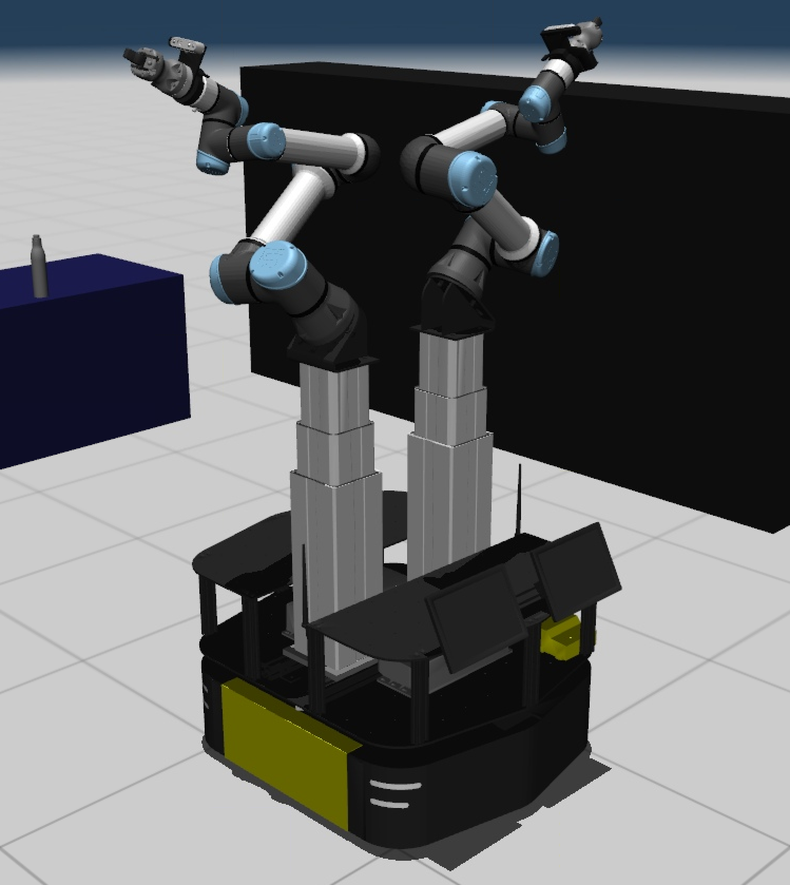

# Phoebe Bridgeback Workspace

Docker enabled ROS 2 workspace for building and running applications with the Phoebe Bridgeback robot.
Phoebe Bridgeback is a dual armed, mobile manipulation platform maintained in the [iMETRO Facility](https://ntrs.nasa.gov/citations/20240013956) at NASA's Johnson Space Center.

The platform includes a Clearpath Ridgeback base, 2x Ewellix column lifts, and 2x UR5e serial manipulators.
Peripherals include wrist mounted Realses D435 cameras along with Robotiq Hand-E grippers.
This workspace includes packages for baseline operation of the hardware system, along with a supported kinematic and dynamic simulation built with MuJoCo.



## Quick Development Setup

1) [Install Docker](https://docs.docker.com/engine/install/ubuntu/)
    - Don't worry about Docker Desktop
    - For Ubuntu recommend using the [utility script](https://docs.docker.com/engine/install/ubuntu/#install-using-the-convenience-script)
2) Install git `sudo apt install git`
3) Clone this repo with submodules

    ```bash
    git clone --recursive git@js-er-code.jsc.nasa.gov:imetro/robots/phoebe-bridgeback/phoebe_bridgeback_ws.git -b humble-feature/full-urdf
    cd phoebe_bridgeback_ws
    ```

    Or to update submodules if you do not do a recursive clone,

    ```bash
    cd phoebe_bridgeback_ws
    git submodule update --init
    ```

4) Set your user information for the project build
    - We recommend just putting this in your `~/.bashrc`:

      ```bash
      export USER_UID=$(id -u $USER)
      export USER_GID=$(id -g $USER)
      ```

    - Alternatively, open the `.env` file in the root of this repo and update each line with your information
        - `USER_UID` and `USER_GID`
            - found using `id -u` and `id -g` respectively

## Using the Images

Build the base images using the compose specification.

To build the development image from the repo root, and then launch it

```bash
# Compile the image
docker compose build

# Start it
docker compose up dev -d

# Connect to the console
docker compose exec dev bash
```

Once you're attached to the container, you can use it as a regular colcon workspace.
The contents of the `src/` directory will be mounted into `/home/er4-user/ws/src`.

To run the things, do the following

```bash
# build the ROS workspace
colcon build

# Start Phoebe ros2 control software with mock_hardware
ros2 launch phoebe_deploy control_mock_hardware.launch.py

# start moveit with rviz!
ros2 launch phoebe_moveit_config phoebe_moveit.launch.py
```

For running things in mujoco, follow these steps

```bash
# build the ROS workspace
colcon build

# Start Phoebe ros2 control software with mujoco sim
ros2 launch phoebe_mujoco_config phoebe_mujoco.launch.py

# Start the sensors launch file to get odometry processed as it would be on the robot
ros2 launch phoebe_deploy ridgeback_sensors.launch.py is_sim:=true

# start moveit with rviz!
ros2 launch phoebe_moveit_config phoebe_moveit.launch.py use_sim_time:=true

# launch nav2
ros2 launch phoebe_nav2_config phoebe_nav.launch.py use_sim_time:=true
```

## Other Things to Note

- Build logs, compiled artifaces, and the `.ccache` are also mounted in the workspace/user home.
This ensure artifacts are persisted even when restarting or recreating the container.

- The `.bash` folder gets mounted into your workspace, and the environment variable `HISTFILE` is set in the docker compose file.
This points the bash to keep the history in this folder, which will persist between docker container sessions so that your history is kept.

- Your host's DDS configuration (either cyclone or fastrtps) will be mounted into the image if set in your environment.
For more information refer to the [compose specification](docker-compose.yaml).

- Defaults for `colcon build` are set for the user. To change or modify, refer to the [defaults file](config/colcon-defaults.yaml).

- We use [MuJoCo](https://mujoco.readthedocs.io/en/stable/XMLreference.html) for many of our dynamic simulations, so we include installing in the [Dockerfile](./Dockerfile).

## Troubleshooting

Common pitfalls and troubleshooting tips are documented in the [troubleshooting guide](./docs/TROUBLESHOOTING.md).

## Citation

This project falls under the purview of the iMETRO project.
If you use this in your own work, please cite the following paper:

```bibtex
@INPROCEEDINGS{imetro-facility-2025,
  author={Dunkelberger, Nathan and Sheetz, Emily and Rainen, Connor and Graf, Jodi and Hart, Nikki and Zemler, Emma and Azimi, Shaun},
  booktitle={2025 22nd International Conference on Ubiquitous Robots (UR)},
  title={Design of the iMETRO Facility: A Platform for Intravehicular Space Robotics Research},
  year={2025},
  volume={},
  number={},
  pages={390-397},
  keywords={NASA;Moon;Seals;Maintenance engineering;Maintenance;Robots;Standards;Open source software;Testing;Logistics},
  doi={10.1109/UR65550.2025.11077983}}
```
